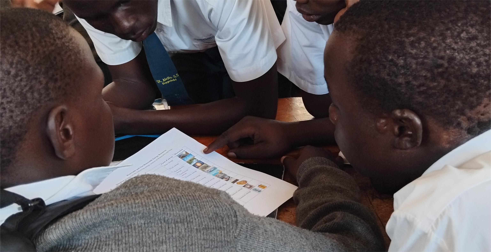
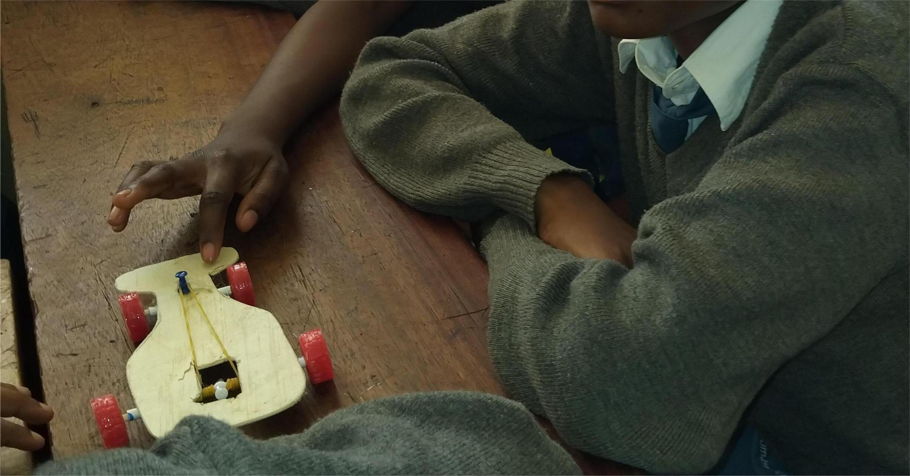
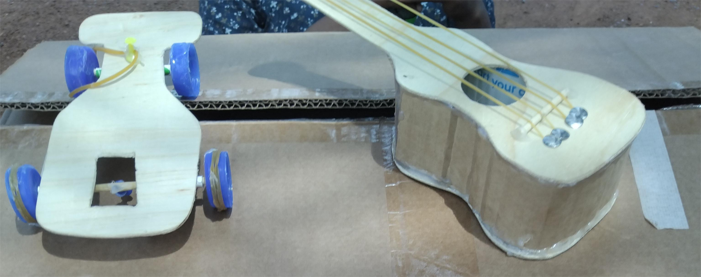
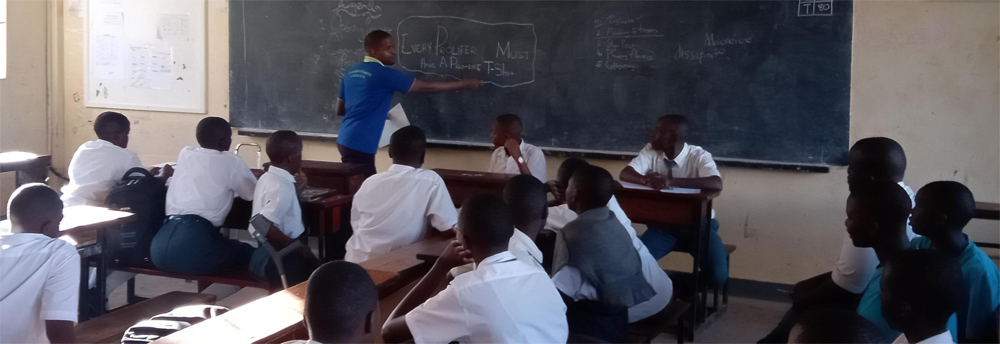

# My-Portfolio
<!--Section 1: Introduce your self-->
## ABOUT ME

Hello! I am Richard Kalega, a STEM educator and curriculum developer with over nine years of experience teaching Physics and Mathematics at secondary school level and hands-on STEM and life skills learning in schools. My work focuses on learner-centred, inquiry-based, and project-based learning, where students learn by building, experimenting, reflecting, and improving. I am passionate about making science and technology accessible, practical, and meaningful for young people.

I advanced my secondary school STEM teaching to a master degree and I am currently pursuing advanced training in Curriculum and Teaching. My academic and professional interests include experiential learning, STEM pedagogy, curriculum innovation, and life skills education. I strongly believe that STEM education should not only build technical knowledge, but also problem-solving skills, critical and creative thinking, collaboration, and responsible citizenship.

<!--Mention your top/relevant skills here - core and soft skills-->
## WHAT I DO

**✅ Hands-On STEM Teaching.**

I design and deliver practical, learner-centred STEM lessons in Physics and Mathematics using:
- Inquiry-based learning
- Project-based and problem-based learning
- Real-world demonstrations and experiments
- Scaffolded instruction for diverse learner abilities

My focus is on helping learners build understanding through doing, not memorisation.

**✅ Curriculum Implementation & Instructional Design.**

Using the knowledge and skills gained from advanced studies, Fund Bots trainings, and other teacher trainings like SESEMAT, I implement national and school curricula while enriching them with:
- Hands-on activities and experiments
- Contextualised examples relevant to learners’ environments
- Clear learning objectives and competency-based assessment

I design schemes of work, lesson plans, modules, and learner activities aligned to measurable outcomes.

**✅ Learning Materials & Project Development.**

I develop and document:
- Conceptualised and experiential learning materials
- Practical classroom experiments using low-cost, locally available materials
- Student project guides and assessment rubrics
- Learning reflections and improvement notes

I design and develop these materials to help learners create verifiable artefacts and build confidence in STEM skills.

**✅ Life Skills, GCE & SDGs Education.**

Beyond technical content, I integrate:
- Life skills education
- Global Citizenship Education (GCE)
- Teaching the Sustainable Development Goals (SDGs)
- Values of teamwork, responsibility, safety, and ethical decision-making

This prepares learners not just for exams, but for life, work, and community leadership.

## CONTACT DETAILS

*Let’s connect!*
<table>
  <tbody>
    <tr>
      <td>📧</td>
      <td><a href="mailto:rickyk2505@gmail.com">rickyk2505@gmail.com</a></td>
    </tr>
    <tr>
      <td>📞</td>
      <td>(+256) 756299040</td>
    </tr>
    <tr>
      <td>📍</td>
      <td>,Kampala, Uganda</td>
    </tr>
    <tr>
      <td>⬇️</td>
      <td><a href="https://etuk123456.github.io/portfolio1/docs/Profile.pdf">Download my CV</a></td>
    </tr>
    <tr>
      <td>🌐</td>
      <td><a href="https://linkedin.com/in/etukanietie">The things I do daily on LinkedIn</a></td>
    </tr>
    <tr>
      <td>📺</td>
      <td><a href="https://www.youtube.com/@LearnwithEtuk">Watch my tutorials on YouTube</a></td>
    </tr>
  </tbody>
</table>

